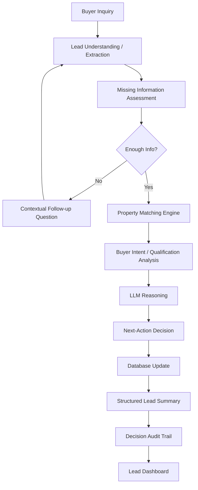

# 🏠 Real Estate Lead Qualification & Routing Agent

## Hackathon Problem Statement

**CYMONIC Campus Recruitment — Agentic Workforce Hackathon**

Real estate brokers waste hours answering property inquiries from unqualified leads, while failing to respond quickly to serious buyers risks losing valuable deals. This AI agent qualifies leads by understanding natural-language inquiries, extracting buyer preferences, matching properties, evaluating intent, and determining the appropriate next business action.

## Business Objective

> Which inquiries deserve a broker's immediate attention, which require additional qualification, and which should be deprioritized?

The system protects broker time while ensuring high-intent buyers receive rapid attention.

## Features

- 📝 **New Lead / Agent Conversation** — Enter natural-language property inquiries, view extracted requirements, and engage in dynamic follow-up conversations
- 🔍 **Lead Analysis** — View intent scores, qualification status, property matches, agent reasoning, and generated email/broker drafts
- 📊 **Lead Dashboard** — Monitor all leads with metrics, filter by intent tier, and inspect individual lead details
- 🤖 **Agentic Reasoning** — Dynamic LLM-based decision making instead of hardcoded rules
- 💬 **Contextual Follow-up** — Agent asks targeted questions based on missing information
- 📋 **Decision Audit Trail** — Every action persisted to SQLite with full history
- 📧 **Generated Drafts** — Email and broker summary drafts rendered in-app (no external sending)

## Architecture



### Agent Pipeline

1. **Parse Inquiry** → Extract budget, location, BHK, timeline, financing from natural language
2. **Assess Missing Fields** → Identify gaps in critical qualification data
3. **Property Matching** → Deterministic weighted scoring against 50-property dataset
4. **Qualification Analysis** → Evidence-based intent scoring from multiple signals
5. **LLM Reasoning** → Context-aware dynamic decision (OpenAI/Ollama fallback)
6. **Action Execution** → Update lead status, persist conversation, create audit trail
7. **Generate Summary** → Structured lead summary + email/broker drafts

## Technology Stack

- **Python 3.11+**
- **Streamlit** — Web UI
- **SQLite** — Persistent storage
- **Pandas** — Data handling
- **Pydantic** — Structured output validation
- **OpenAI API / Ollama** — LLM provider abstraction
- **python-dotenv** — Environment management
- **pytest** — Testing

## Dataset Design

### Property Dataset (~50 properties)
Realistic Kerala/Thiruvananthapuram properties across locations: Technopark, Kazhakkoottam, Sreekaryam, Akkulam, Ulloor, Pattom, Kowdiar, Vazhuthacaud, Peroorkada, Kesavadasapuram, Thampanoor, Poojappura.

Fields: property_id, name, location, property_type, bhk, price, sqft, parking, furnishing, amenities, availability, builder, possession_status, tags, created_at

### Seed Lead Dataset (~20 historical leads)
Diverse lead types: hot (HIGH), warm (MEDIUM), incomplete (NEEDS_CLARIFICATION), unrealistic (LOW), long-term (NURTURE).

Fields: lead_id, name, original_inquiry, parsed_requirements, intent_score, intent_tier, status, current_action, conversation_history, decision_history

## Database Schema

### properties
| Field | Type | Description |
|-------|------|-------------|
| property_id | TEXT PK | Unique identifier |
| name | TEXT | Property name |
| location | TEXT | Area/location |
| property_type | TEXT | Apartment/Villa |
| bhk | INTEGER | Bedrooms |
| price | INTEGER | Price in INR |
| sqft | INTEGER | Area |
| parking | INTEGER | Parking slots |
| furnishing | TEXT | Furnishing type |
| amenities | TEXT | Comma-separated list |
| availability | TEXT | Ready/Under Construction |
| builder | TEXT | Builder name |
| possession_status | TEXT | Possession date |
| tags | TEXT | Comma-separated tags |
| created_at | TEXT | Date |

### leads
| Field | Type | Description |
|-------|------|-------------|
| lead_id | TEXT PK | Unique identifier |
| name | TEXT | Buyer name |
| original_inquiry | TEXT | Raw inquiry text |
| parsed_requirements | TEXT (JSON) | Extracted requirements |
| intent_score | INTEGER | 0-100 |
| intent_tier | TEXT | HIGH/MEDIUM/LOW/NEEDS_CLARIFICATION |
| status | TEXT | Current status |
| current_action | TEXT | Decision action |
| conversation_history | TEXT (JSON) | Conversation turns |
| decision_history | TEXT (JSON) | All decisions made |

### conversations
| Field | Type | Description |
|-------|------|-------------|
| conversation_id | INTEGER PK | Auto-increment |
| lead_id | TEXT FK | Reference to lead |
| turn_number | INTEGER | Turn counter |
| sender | TEXT | buyer/agent |
| message | TEXT | Message content |
| timestamp | TEXT | ISO timestamp |

### agent_actions
| Field | Type | Description |
|-------|------|-------------|
| action_id | INTEGER PK | Auto-increment |
| lead_id | TEXT FK | Reference to lead |
| timestamp | TEXT | ISO timestamp |
| decision | TEXT | Action taken |
| reasoning | TEXT (JSON) | Agent reasoning bullets |
| intent_score | INTEGER | Score at time of decision |
| input_snapshot | TEXT (JSON) | Input context |
| output_snapshot | TEXT (JSON) | Output result |

## Agent Input/Output Contract

### LLM Response Schema (Pydantic-validated)
```json
{
  "intent_score": 88,
  "intent_tier": "HIGH",
  "decision": "ESCALATE_TO_BROKER",
  "reasoning": ["Budget is realistic for requested locations", "Three strong inventory matches available"],
  "missing_information": [],
  "risks": [],
  "recommended_next_step": "Broker should arrange a property viewing.",
  "follow_up_question": null
}
```

### Decision Enum
- `ASK_MORE_INFO` — Insufficient information, need clarification
- `SHOW_MATCHING_PROPERTIES` — Enough info, show matches
- `ESCALATE_TO_BROKER` — High intent, ready for broker
- `NURTURE_LEAD` — Low urgency, nurture over time
- `LOW_PRIORITY_OR_DISCARD` — Unrealistic or low quality lead

## Setup Instructions

```bash
# Clone repository
git clone https://github.com/matrix29v-eventt/Real-Estate-Agent.git
cd Real-Estate-Agent

# Copy environment template
cp .env.example .env
# Edit .env with your LLM credentials (optional)

# Install dependencies
pip install -r requirements.txt

# Run the application
streamlit run app.py

# Run tests
pytest tests/ -v
```

## Environment Variables

| Variable | Description | Default |
|----------|-------------|---------|
| `OPENAI_API_KEY` | OpenAI API key | (none) |
| `OPENAI_MODEL` | OpenAI model | `gpt-4o-mini` |
| `OLLAMA_BASE_URL` | Ollama base URL | `http://localhost:11434` |
| `OLLAMA_MODEL` | Ollama model | `llama3` |
| `LLM_PROVIDER` | Provider: `openai` or `ollama` | `openai` |
| `DB_PATH` | SQLite database path | `data/app.db` |

**Note:** If no LLM is configured, the application uses a rule-based fallback for reasoning and shows a UI warning.

## Demo Scenarios

### Scenario 1 — High Intent Buyer
**Input:** "Looking for a 3BHK apartment around Technopark or Kazhakkoottam. Budget ₹65-75 lakh. Planning to purchase within 2 months. Need parking and preferably a gated community. Home loan is already being processed."

**Expected:** Extracts all information, finds relevant matches, HIGH intent → ESCALATE_TO_BROKER

### Scenario 2 — Ambiguous Lead
**Input:** "I need a nice flat in Trivandrum."

**Expected:** Recognizes missing critical information, dynamically asks for budget/location/timeline. After follow-up with strong details, decision changes to SHOW_MATCHING_PROPERTIES.

### Scenario 3 — Unrealistic Requirement
**Input:** "I want a 4BHK premium property in Kowdiar for ₹25 lakh."

**Expected:** Recognizes poor budget/location compatibility, explains mismatch, does not invent matching properties.

### Scenario 4 — Long-Term Browser
**Input:** "Looking at 3BHK properties around ₹80 lakh but probably won't buy for another 18 months."

**Expected:** Recognizes low urgency, likely NURTURE_LEAD instead of immediate escalation.

### Scenario 5 — Context Change
**Initial:** "I need a nice flat in Trivandrum." → ASK_MORE_INFO
**Follow-up:** "Around 65 lakh, close to Technopark, within two months." → Decision changes to SHOW_MATCHING_PROPERTIES

## Why This Is Not Merely Hardcoded Rules

The final next-action decision is made by the LLM based on the **full lead context** including:
- All extracted requirements
- Property match results and scores
- Missing information assessment
- Conversation history
- Multiple evidence signals (budget clarity, location specificity, timeline, financing readiness, etc.)

The LLM receives this contextual evidence and reasons about the appropriate action. Supporting calculations (property matching, scoring) are deterministic Python code, but the final routing decision is LLM-driven.

When no LLM is available, a rule-based fallback generates evidence-based reasoning — but this is clearly indicated to the user.

## Important Note

**Buyer Intent assessment is NOT identity/KYC verification.** The system evaluates lead quality and qualification signals only. It does not verify buyer identity or legal status.

## Limitations

- LLM requires API key for full dynamic reasoning (rule-based fallback available)
- Property dataset is synthetic (50 properties in Kerala market)
- No external communication channels are implemented — all outputs are in-app drafts
- Follow-up questions are dynamically generated but may not cover all edge cases
- Conversation history is stored in JSON within SQLite, not a dedicated message queue

## Future Improvements

- Add vector database for semantic property matching
- Implement multi-turn conversation with memory
- Add lead scoring history visualization
- Support multiple LLM providers (Anthropic, Google, local models)
- Add lead scoring calibration based on actual conversion data
- Implement broker notification system (in-app only)
- Add lead source tracking and attribution

## Author

Built for the **CYMONIC Campus Recruitment — Agentic Workforce Hackathon**
