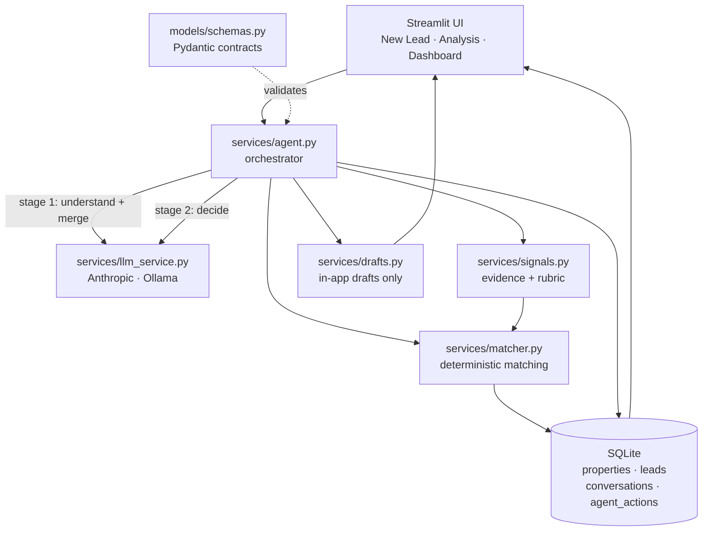

# Real Estate Lead Qualification & Routing Agent

An AI agent that decides **which property inquiries deserve a broker's immediate
attention, which need more qualification, and which should be deprioritised.**

Built for the **CYMONIC Campus Recruitment — Agentic Workforce Hackathon**,
Problem #4 — *Real Estate Lead Qualifier*.

---

## 1. Hackathon problem statement

> Real estate brokers waste hours answering property inquiries from unqualified
> leads, while failing to respond quickly to serious buyers risks losing valuable
> deals.

Before a lead reaches a broker, the system must understand pricing expectations,
preferred locations, property requirements, purchase timeline, financing
readiness and enough surrounding context to judge whether the lead is real.

Qualified leads get immediate attention. Ambiguous leads get clarified first.
Weak or clearly unrealistic leads get deprioritised.

## 2. Business objective

This is **not** a property-search chatbot. Every conversation exists to produce a
routing decision:

> Protect broker time while ensuring high-intent buyers receive rapid attention.

The deliverable of every turn is a **next-action decision with reasoning, plus a
structured lead summary**, persisted with a full audit trail.

---

## 3. Features

- **Two roles behind a sign-in.** Buyers submit an enquiry and follow their own
  lead; brokers see the full pipeline, every conversation and the inventory.
  (Demo role switch, not authentication — see section 15.)
- Natural-language inquiry understanding with **context merging across turns** —
  answering a follow-up never resets what the buyer already said.
- **Dynamic follow-up questions** chosen from what is actually missing, not a
  fixed questionnaire.
- Deterministic **property matching** against a 53-property synthetic inventory,
  with a compatibility percentage, match reasons and explicit gaps.
- Deterministic **evidence pack**: information completeness, missing critical
  fields, budget realism against the real price floor, contradiction detection
  across turns, and a transparent heuristic rubric.
- **LLM next-action reasoning** over that evidence — the decision is judgement,
  not a threshold.
- Controlled decision enum, validated structured output, and a **retry-then-fail**
  policy: nothing is fabricated when the model misbehaves.
- **Generated drafts** for broker escalations and buyer replies, rendered inside
  the app. Nothing is ever sent anywhere.
- **Persistent lead records, conversations and a decision audit trail** with
  visible status transitions (`NEW → NEEDS_INFORMATION → BROKER_ESCALATION`).
- Broker dashboard with tier/status filters and per-lead inspection.
- Broker-only property inventory browser with area/type/BHK/price filters.

---

## 4. How the agentic reasoning works

```
Buyer inquiry + stored lead context
        │
        ▼
[LLM]  Stage 1 — understanding & context merge
        │        extract requirements, merge with everything already known
        ▼
[code] Property matching            deterministic, weighted, explainable
[code] Evidence pack                completeness, missing fields, budget realism,
        │                           contradictions, heuristic rubric score
        ▼
[LLM]  Stage 2 — qualification & next-action reasoning
        │        weighs the whole situation, chooses one of six actions,
        │        writes the reasoning, risks and the outgoing draft
        ▼
[code] Validate → persist lead → log decision → update status → summary
```

Two LLM calls per turn: one parsing task, one judgement task. Everything
mechanical in between is plain Python.

### Why this is not "hardcoded rules"

The brief is explicit that the final business decision must be reasoned, not
computed. Here is exactly where the line sits.

| Stage | Implementation | Why |
|---|---|---|
| Extract & merge requirements | LLM (`services/agent.py`) | Natural language |
| Filter / score inventory | Python (`services/matcher.py`) | Arithmetic, must be reproducible |
| Missing-field analysis | Python (`services/signals.py`) | Set comparison |
| Budget realism vs. market floor | Python (`services/matcher.py`) | Arithmetic on real data |
| Contradiction detection | Python (`services/signals.py`) | Diff between turns |
| Heuristic rubric score | Python (`services/signals.py`) | **Evidence only** |
| **Next-action decision** | **LLM** | **Judgement over the whole context** |
| Status bookkeeping | Python (`ACTION_TO_STATUS`) | Clerical, after the decision |

There is no `if score > 80: escalate` anywhere in this repository. The rubric
score is passed to the agent as one labelled input among many, explicitly
described in the prompt as *"not a rule and not a threshold"*. When the agent's
own score diverges from the rubric by 25 points or more, the UI surfaces that
divergence rather than hiding it — the disagreement is the interesting part.

Concretely, the same rubric score produces different actions:

- 85/100 with a two-month timeline and approved financing → `ESCALATE_TO_BROKER`
- 85/100 with an 18-month timeline → `NURTURE_LEAD`, and the reasoning says why
- 52/100 with an unrealistic budget → `RESET_EXPECTATIONS`, not another question,
  because more questions cannot fix arithmetic
- 52/100 with a genuine gap → `ASK_MORE_INFO` with one specific question

---

## 5. Architecture



### Module map

| Path | Responsibility |
|---|---|
| `app.py` | Streamlit entry point, view navigation, LLM status sidebar |
| `config.py` | Paths, env loading, market constants, area adjacency |
| `models/schemas.py` | Pydantic contracts, enums, rupee parsing, status mapping |
| `services/db.py` | SQLite schema, CRUD, audit trail, dashboard aggregates |
| `services/matcher.py` | Weighted compatibility scoring, inventory stats, budget realism |
| `services/signals.py` | Missing fields, contradictions, heuristic rubric |
| `services/llm_service.py` | Provider abstraction, structured JSON, recovery |
| `services/agent.py` | The two-stage pipeline and persistence |
| `services/drafts.py` | Draft rendering (never sends) |
| `services/auth.py` | Demo roles, name normalisation, broker access code |
| `ui/login.py` | Sign-in screen (buyer / broker) |
| `ui/buyer.py` | Buyer portal: submit an enquiry, follow it, see matches |
| `ui/properties.py` | Broker-only inventory browser |
| `ui/` | View modules and shared render helpers |
| `data/property_seed.py` | 53 synthetic Trivandrum properties |
| `data/lead_seed.py` | 20 historical leads with conversations and decisions |
| `scripts/run_scenarios.py` | Manual end-to-end demo harness |
| `tests/` | 66 pytest tests, no network access (incl. AppTest render smoke tests) |

---

## 6. Technology stack

Python 3.11 · Streamlit · SQLite (stdlib `sqlite3`) · Pandas · Pydantic v2 ·
`anthropic` SDK · optional Ollama · pytest.

No React, FastAPI, Docker, Redis, vector database or auth layer — none of them
would earn their complexity in a five-hour build.

---

## 7. Dataset design

### Properties (53 records, `data/property_seed.py`)

Twelve Thiruvananthapuram areas: Kazhakkoottam, Technopark, Sreekaryam, Akkulam,
Ulloor, Pattom, Kowdiar, Vazhuthacaud, Peroorkada, Kesavadasapuram, Thampanoor,
Poojappura. Fields: `property_id, name, location, property_type, bhk, price,
sqft, parking, furnishing, amenities, availability, builder, possession_status,
possession_date, tags, created_at`.

Tags include `premium`, `budget`, `investment`, `family`, `technopark-nearby`,
`ready-to-move`, `gated-community`, `high-demand`.

**The dataset is deliberately uneven**, because a catalogue where everything
matches makes reasoning unnecessary:

- No 4BHK anywhere below **Rs 1.42 Cr**; the cheapest Kowdiar listing is **Rs 95 L**.
- Three sold-out records and one on hold — never offered as options.
- Five projects under construction with real possession dates, which interact
  with the buyer's timeline.
- Price-per-sqft bands differ by area, so the same budget buys very different
  things in Thampanoor and Kowdiar.

### Leads (20 records, `data/lead_seed.py`)

Hot buyers, warm-but-incomplete inquiries, self-contradicting buyers,
unrealistic budgets, long-horizon browsers and pure tyre-kickers. Each seeded
lead carries its conversation and one archived decision, so the dashboard and
audit trail are populated on first launch. Their top matches are computed with
the real matching engine, not hand-written.

---

## 8. Database design

| Table | Purpose | Key fields |
|---|---|---|
| `properties` | Synthetic inventory | `property_id` PK, location, price, bhk, availability, tags |
| `leads` | Current structured lead state | `lead_id` PK, `owner` (buyer account), `requirements_json`, `intent_score`, `intent_tier`, `status`, `current_action`, `summary_json`, timestamps |
| `conversations` | Every buyer/agent turn | `lead_id`, `turn_index`, `role`, `message` |
| `agent_actions` | Decision audit trail | `decision`, `reasoning_json`, `intent_score`, `input_snapshot`, `output_snapshot`, `status_before`, `status_after`, `llm_provider` |

Lead lifecycle: `NEW → QUALIFYING / NEEDS_INFORMATION → QUALIFIED →
BROKER_ESCALATION`, plus `NURTURING` and `LOW_PRIORITY`. Every agent turn writes
a row to `agent_actions` with both snapshots, so any past decision can be
replayed and audited.

---

## 9. Setup

```bash
git clone https://github.com/matrix29v-eventt/Real-Estate-Agent.git
cd Real-Estate-Agent

python -m venv .venv
# Windows:  .venv\Scripts\activate
# macOS/Linux:  source .venv/bin/activate

pip install -r requirements.txt
cp .env.example .env      # then edit .env
```

### Environment variables

Copy `.env.example` to `.env`. **Never commit `.env`** — it is git-ignored.

| Variable | Purpose |
|---|---|
| `LLM_PROVIDER` | `anthropic`, `ollama`, or `auto` (default) |
| `ANTHROPIC_API_KEY` | Anthropic API key |
| `ANTHROPIC_MODEL` | Defaults to `claude-opus-5` |
| `OLLAMA_BASE_URL` | Local Ollama endpoint |
| `OLLAMA_MODEL` | Local model name |
| `BROKER_ACCESS_CODE` | Shared demo code unlocking the broker view (default `broker123`) |
| `REALESTATE_DB` | Override the SQLite file path |
| `LLM_TIMEOUT_SECONDS` | Per-call timeout |

If no model is configured the app **says so** and refuses to analyse. It never
invents an assessment.

### Run

```bash
streamlit run app.py
```

The database is created and seeded automatically on first launch at
`data/realestate.db`. "Reset demo data" in the broker sidebar restores it.

### Signing in

| Role | How | What you get |
|---|---|---|
| **Buyer** | Any name, no code | Submit an enquiry, answer follow-ups, see your matched properties and your own enquiries |
| **Broker** | Name + access code (`broker123` by default) | All three pipeline views plus the property inventory |

Sign in as a buyer in one browser and a broker in a private window to watch an
enquiry arrive in the broker pipeline.

---

## 10. Demo scenarios

`scripts/run_scenarios.py` runs all five against the configured model:

```bash
python scripts/run_scenarios.py            # all five
python scripts/run_scenarios.py --only 3   # just one
```

Or paste them in the UI — the **Load a demo scenario** expander prefills each.

1. **High-intent buyer** — "3BHK around Technopark or Kazhakkoottam, 65–75 lakh,
   purchasing within 2 months, parking, gated community, home loan in process."
   → complete requirements, several ready-to-move matches, broker escalation with
   the urgency and inventory fit cited.

2. **Ambiguous inquiry** — "I need a nice flat in Trivandrum."
   → all three critical fields missing; the agent asks one contextual question
   rather than qualifying. Match percentages are explicitly flagged as
   meaningless at this stage.

3. **Unrealistic requirement** — "4BHK premium property in Kowdiar for 25 lakh."
   → the evidence shows the entry price is Rs 2.45 Cr, roughly 10× the budget.
   No properties are invented; the agent explains the mismatch and offers
   flexibility instead of escalating.

4. **Long-term browser** — "3BHK around 80 lakh, but probably not for 18 months."
   → budget is realistic and matches exist, but the timeline drives the call.
   Nurture rather than escalate, with the timeline named in the reasoning.

5. **Context change** — a vague first message, then budget, area, timeline and
   financing in the reply.
   → the merged state keeps turn-1 context, and the displayed assessment visibly
   changes (`NEEDS_CLARIFICATION → HIGH`, `ASK_MORE_INFO → ESCALATE_TO_BROKER`).
   This is the clearest demonstration that the decision is contextual.

---

## 11. Testing

```bash
python -m pytest -q
```

66 tests, no network access — the agent pipeline is exercised with a scripted
provider so results are deterministic. Coverage:

- database initialisation, seeding idempotency and dataset gap invariants
- property matching, budget caps, unavailable-stock exclusion, realism verdicts
- missing-field analysis, contradiction detection, rubric penalties
- structured output validation, coercion and rejection of malformed decisions
- context merging across conversation turns
- lead persistence, status transitions and agent-action audit rows
- draft rendering, including the "nothing is sent" disclaimer
- rollback of a lead created by a turn that failed before reaching a decision
- per-stage progress reporting, and a no-criteria "only browsing" inquiry
- Streamlit render smoke tests (`streamlit.testing.v1.AppTest`) covering all
  three views, every lead archetype, and the missing-LLM warning path

---

## 12. Limitations

- **The sign-in is a demo role switch, not authentication.** There are no user
  accounts, no passwords are stored, and broker access is one shared code held
  in plain text in the environment. Buyers are identified by the name they type,
  so anyone who types the same name reaches the same enquiries. Lead ownership
  separates the two demo experiences; it is not a security boundary. A real
  deployment would replace `services/auth.py` with an identity provider.
- **Buyer intent is not identity verification.** Nothing here performs KYC,
  proves who anyone is, or validates documents. It assesses lead quality and
  purchase readiness from what the buyer says.
- The property dataset is **synthetic**. Prices are modelled on the Trivandrum
  market but no listing is real.
- Decision quality tracks model quality. The prompts are written for
  `claude-opus-5`; small local models will follow the reasoning instructions
  less reliably.
- **A turn makes two LLM calls and is synchronous.** On a slow local model that
  can be minutes; the UI reports each stage and the elapsed time, but there is no
  cancel button and no streaming. Measured on one CPU machine: `llama3.2:3b`
  ~89 s per turn, `gemma4` many minutes (unusable). Use Anthropic for a
  responsive demo.
- No authentication, multi-user support or concurrency control — SQLite with a
  single Streamlit process.
- The agent's own intent score is not calibrated against outcome data; it is a
  judgement, and the deterministic rubric is shown alongside it for contrast.
- Contradiction detection compares against the immediately previous snapshot,
  not the entire conversation history.

## 13. Future improvements

- Calibrate intent scores against closed-deal outcomes.
- Let the agent request a specific inventory query instead of receiving a
  pre-computed top five.
- Multi-broker routing by specialisation and current workload.
- Scheduled re-evaluation so nurture leads resurface when their timeline arrives.
- Confidence-gated human review before any escalation is acted on.
- Batch triage of an inbox of inquiries rather than one at a time.

---

## 14. Honest scope statement

This application:

- **does not** authenticate anyone — the sign-in is a demo role switch;
- **does not** send email, SMS, WhatsApp or any external message — every
  notification is a draft displayed in the UI;
- **does not** perform KYC or identity verification;
- **does not** use real property listings or real buyer data;
- **does not** fabricate an analysis when no LLM is configured.
